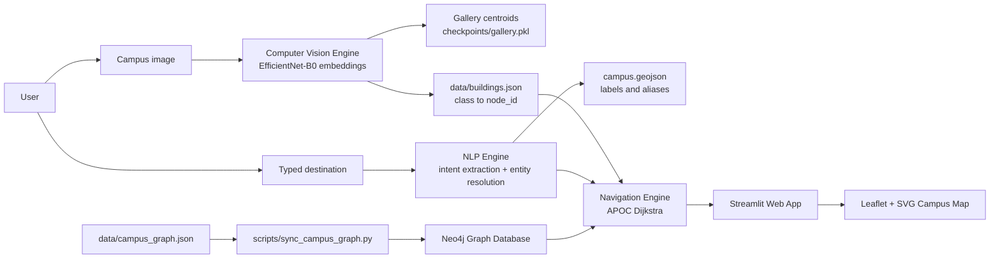
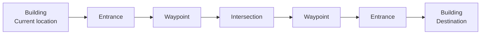
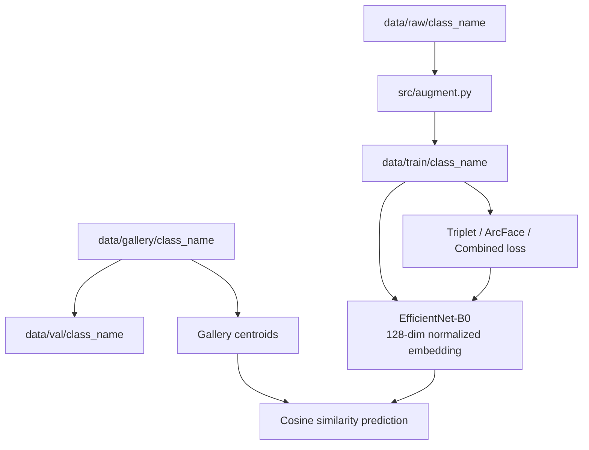
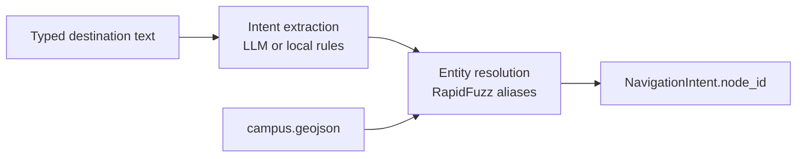

# ENSAM Smart Navigation System


An intelligent campus navigation system for ENSAM that combines **Computer Vision**, **Natural Language Processing**, and **Graph-Based Routing** to help users identify their current location and navigate to a destination on an interactive campus map.

The system is designed as an applied AI engineering project: a user uploads an image of their surroundings, the vision model recognizes the building or door area, the user types a destination, the NLP pipeline resolves that destination to a campus node, and the navigation engine computes a realistic route through a graph of walkable paths.

---

## Motivation

Large campuses can be difficult to navigate for new students, visitors, and staff. Static maps are useful, but they do not answer the most important question: **"Where am I, and how do I get to the place I need?"**

This project explores how multiple AI components can work together in one practical system:

- Computer Vision localizes the user from a building or door image.
- NLP converts typed destination requests into structured destination nodes.
- Graph routing computes paths through real campus walkways.
- Streamlit and Leaflet/SVG provide an interactive user interface.
- Neo4j stores the navigation graph and enables shortest-path queries.

---

## Key Features

- Location recognition from campus images using deep learning.
- Metric-learning CV pipeline with EfficientNet-B0 embeddings.
- Text-based destination input.
- NLP destination extraction and fuzzy entity resolution.
- Optional local LLM support through Ollama.
- Interactive campus map rendered from a custom SVG.
- Graph-based shortest path navigation.
- Neo4j graph database synchronization.
- Route visualization with current-position and destination markers.
- Validation scripts for class synchronization and graph consistency.
- Lightweight browser-based SVG graph editor for manual waypoint editing.

---

## System Architecture



---

## Engineering Overview

The application is built around a clear separation of responsibilities:

| Layer | Responsibility |
| --- | --- |
| `cv_engine/` | Image embedding model, gallery matching, location prediction |
| `nlp_engine/` | Destination extraction and entity resolution |
| `app/navigation/` | Neo4j access, shortest path calculation, map rendering |
| `src/` | Training, augmentation, evaluation, validation utilities |
| `scripts/` | Graph synchronization and migration scripts |
| `data/` | Campus graph, building metadata, image datasets, validation reports |
| `interactive_map/` | Browser-based SVG graph editor |

The most important engineering decision is that **the graph is the navigation source of truth**. The CV model does not directly draw routes. It predicts a semantic class, then `data/buildings.json` maps that class to a graph `node_id`. The route is calculated from graph topology, not from visual predictions alone.

---

## Navigation Graph Architecture

The project uses a realistic walkable-path graph instead of direct building-to-building lines.



This structure is critical. A direct edge such as:

```text
Building A -> Building B
```

would produce a straight line that may cut across buildings or non-walkable areas. Instead, the graph follows the real campus walkways:

```text
Building -> Entrance -> Waypoint -> Intersection -> Entrance -> Building
```

Each edge stores a distance or weight, and each node can carry metadata such as:

```json
{
  "id": "bibliotheque",
  "name": "Bibliotheque",
  "node_role": "building",
  "visible_destination": true,
  "coords": [420.0, 180.0],
  "floor": 0
}
```

---

## Routing Algorithm

The runtime navigation engine uses Neo4j relationships named `CONNECTED_TO` and computes the shortest path using APOC Dijkstra:

```cypher
MATCH (start:Node {id: $start_id})
MATCH (end:Node {id: $end_id})
CALL apoc.algo.dijkstra(start, end, 'CONNECTED_TO>', 'distance')
YIELD path, weight
RETURN nodes(path), relationships(path), weight
```

The returned route is converted into:

- ordered path node IDs,
- node metadata,
- edge distances,
- turn-by-turn instructions,
- route coordinates for Leaflet polyline rendering.

The graph can also be validated locally with NetworkX before being synchronized into Neo4j.

---

## Computer Vision Pipeline

The CV module uses a metric-learning approach rather than a simple classifier head.



### Model Design

| Component | Design |
| --- | --- |
| Backbone | EfficientNet-B0 pretrained on ImageNet |
| Frozen layers | Early feature blocks for stable visual features |
| Trainable layers | Later blocks and projection head |
| Embedding | 128-dimensional L2-normalized vector |
| Matching | Cosine similarity against gallery centroids |
| Loss options | Batch-hard triplet, ArcFace, combined |

### Why Metric Learning?

Campus recognition often receives few images per building and may need new classes over time. Metric learning makes this easier because the system can compare embeddings to curated gallery examples instead of depending only on a fixed classification head.

### Data Split

```text
data/
├── raw/       # raw training images, one folder per class
├── gallery/   # curated reference images for centroids
├── train/     # augmented training images
└── val/       # fixed validation set copied from gallery
```

`data/buildings.json` is the class source of truth. Folder names, model classes, gallery labels, and navigation node IDs must remain synchronized.

---

## NLP Pipeline

The NLP pipeline converts a user destination request into a graph node ID.



The LLM is not trusted to invent node IDs. It extracts the raw destination mention, then the resolver matches that mention against controlled campus aliases from GeoJSON.

Supported destination inputs may include French, English, Arabic, transliteration, abbreviations, and common informal names, depending on the aliases available in the campus data.

---

## Dataset Description

The dataset is organized around ENSAM campus locations. Each class corresponds to a visible building, department, room group, or campus destination.

The current building metadata file contains 17 navigation classes, including examples such as:

- Administration des Etudiants
- Amphitheatre
- Bibliotheque
- Centre de Langue
- Centre de Recherche
- Departement AEEE
- Departement Civil
- Departement Energetique
- Departement Mathematiques-Informatique
- TD1
- TD2
- TP Fabrication Mecanique

The project intentionally separates:

- `raw/` for training source images,
- `gallery/` for curated reference examples,
- `val/` for validation,
- `train/` for generated augmented samples.

This avoids contaminating evaluation with training images and makes future retraining more reproducible.

---

## Installation

### 1. Clone the repository

```bash
git clone https://github.com/<your-username>/ensam-smart-navigation-system.git
cd ensam-smart-navigation-system
```

### 2. Create a virtual environment

```bash
python -m venv .venv
.venv\Scripts\activate
```

On macOS/Linux:

```bash
python -m venv .venv
source .venv/bin/activate
```

### 3. Install dependencies

```bash
pip install -r requirements.txt
```

For the retraining pipeline, install the CV-specific dependencies if needed:

```bash
pip install -r cv_engine/requirements.txt
pip install albumentations==1.3.1
```

### 4. Start Neo4j

Using Docker:

```bash
docker compose up -d
```

Default local credentials in `docker-compose.yml`:

```text
NEO4J_URI=bolt://localhost:7687
NEO4J_USER=neo4j
NEO4J_PASSWORD=ensam360password
```

You may also create a `.env` file:

```env
NEO4J_URI=bolt://localhost:7687
NEO4J_USER=neo4j
NEO4J_PASSWORD=ensam360password
```

### 5. Synchronize the campus graph

```bash
python scripts\sync_campus_graph.py
```

### 6. Run the Streamlit app

```bash
python -m streamlit run app\main.py
```

Then open:

```text
http://localhost:8501
```

---

## Usage

1. Upload an image of your current campus environment.
2. The CV model predicts the most likely location.
3. Confirm the detected location.
4. Enter your destination as text.
5. The NLP pipeline resolves the destination to a graph node.
6. The navigation engine computes the shortest route.
7. The route is displayed on the SVG campus map.

---

## Training and Evaluation

All commands should be run from the repository root.

### Build validation set

```bash
python -m src.build_val --data_dir data --n_images 10 --seed 42
```

### Check data synchronization

```bash
python -m src.sync_check --data_dir data --checkpoint checkpoints/best_model.pth
```

### Generate augmented training data

```bash
python -m src.augment --data_dir data --target_count 200 --seed 42
```

For a final training run:

```bash
python -m src.augment --data_dir data --target_count 300 --seed 42
```

### Retrain the model

```bash
python -m src.retrain --data_dir data --loss triplet --seed 42
```

Alternative losses:

```bash
python -m src.retrain --data_dir data --loss arcface --seed 42
python -m src.retrain --data_dir data --loss combined --seed 42
```

### Evaluate

```bash
python -m src.evaluate --data_dir data --checkpoint checkpoints/best_model.pth --gallery_path checkpoints/gallery.pkl --output_dir outputs
```

Evaluation outputs include:

- `outputs/eval_report.json`
- `outputs/training_stats.json`
- `outputs/confusion_matrix.png`
- `outputs/tsne.png`

---

## Validation Commands

Use these commands before publishing results or demoing the app:

```bash
python -m compileall -q app cv_engine nlp_engine src scripts
python -m src.sync_check --data_dir data --checkpoint checkpoints/best_model.pth
python -m src.graph_validator --graph data\campus_graph.json
python scripts\sync_campus_graph.py
python -m nlp_engine.test_pipeline
```

---

## Results and Metrics

The current training statistics show strong retrieval performance on the validation setup, with Recall@1 reaching up to `1.0000` during the recorded triplet-loss run in `outputs/training_stats.json`.

Important note: model performance should be reported from the latest `outputs/eval_report.json` generated against the current 17-class dataset. If an older `model_metrics.json` contains only a subset of classes, it should not be used as a final academic result.

Recommended reporting table:

| Metric | Source | Notes |
| --- | --- | --- |
| Recall@1 / Recall@3 / Recall@5 | `outputs/eval_report.json` | Retrieval quality |
| F1-score | `outputs/eval_report.json` | Per-class and macro performance |
| Confusion matrix | `outputs/confusion_matrix.png` | Error analysis |
| t-SNE | `outputs/tsne.png` | Embedding separability |
| Graph validation | `data/validation_report.json` | Connectivity and edge checks |

---

## Project Structure

```text
ensam_navigation_app/
├── app/
│   ├── main.py
│   ├── navigation/
│   │   ├── engine.py
│   │   ├── graph_store.py
│   │   └── map_manager.py
│   └── static/
│       └── campus_map_2d1.svg
├── cv_engine/
│   ├── inference.py
│   ├── model.py
│   ├── train.py
│   └── checkpoints/
├── nlp_engine/
│   ├── pipeline.py
│   ├── intent_extractor.py
│   ├── entity_resolver.py
│   ├── llm_backend.py
│   └── data/
├── src/
│   ├── augment.py
│   ├── build_val.py
│   ├── dataset.py
│   ├── evaluate.py
│   ├── graph_validator.py
│   ├── losses.py
│   ├── retrain.py
│   └── sync_check.py
├── scripts/
│   ├── sync_campus_graph.py
│   └── audit_routing_graph.py
├── interactive_map/
│   ├── svg_graph_editor.html
│   ├── svg_graph_editor.css
│   └── svg_graph_editor.js
├── data/
│   ├── buildings.json
│   ├── campus_graph.json
│   ├── campus.geojson
│   ├── raw/
│   ├── gallery/
│   ├── train/
│   └── val/
├── outputs/
├── docker-compose.yml
├── requirements.txt
└── README.md
```

---

## Graph Editing Workflow

The project includes a lightweight SVG graph editor under `interactive_map/`.

It can be used to:

- load the campus SVG,
- add nodes by clicking exact SVG coordinates,
- edit node IDs and roles,
- create edges between nodes,
- drag nodes,
- delete nodes and edges,
- export a compatible `campus_graph.json`.

Recommended graph design rules:

- Use `building` only for visible destinations.
- Add one `entrance` node near each building access point.
- Add `waypoint` nodes along visible campus paths.
- Add `intersection` nodes at path crossings.
- Avoid long direct edges.
- Keep every edge short enough to visually follow a real walkway.

---

## Optional Ollama Setup

If using the local LLM-backed NLP extractor:

```bash
ollama pull llama3.2:3b
ollama serve
```

Then configure `nlp_engine/config.yaml`:

```yaml
backend: "ollama"
ollama_model: "llama3.2:3b"
```

The resolver remains grounded in campus aliases, so the LLM is used for extraction rather than unchecked destination selection.

---

## Repository Publication Suggestions

### Repository Name

Recommended:

```text
ensam-smart-navigation-system
```

Alternative names:

- `ensam-ai-campus-navigator`
- `smart-campus-navigation-ai`
- `ensam-vision-nlp-navigation`

### Repository Description

```text
AI-powered ENSAM campus navigation system combining computer vision, NLP, Neo4j graph routing, and Streamlit map visualization.
```

### Topics / Tags

```text
computer-vision
campus-navigation
streamlit
pytorch
neo4j
nlp
ollama
networkx
leaflet
graph-routing
metric-learning
smart-campus
```

### Project Banner Idea

Create a wide banner showing:

- ENSAM campus map in the background,
- a highlighted route polyline,
- a small camera/image recognition card,
- an NLP destination text-input card,
- the title: `ENSAM Smart Navigation System`.

Recommended size:

```text
1280 x 640
```

Suggested path:

```text
docs/assets/banner.png
```

Then add it at the top of the README:

```markdown

```

### Screenshots to Include Before Publication

Recommended demo assets:

| Asset | Suggested path |
| --- | --- |
| Streamlit home screen | `docs/assets/app_home.png` |
| Image upload and prediction result | `docs/assets/cv_prediction.png` |
| Destination input / NLP result | `docs/assets/nlp_destination.png` |
| Route drawn on campus map | `docs/assets/route_visualization.png` |
| Neo4j graph browser view | `docs/assets/neo4j_graph.png` |
| Confusion matrix | `docs/assets/confusion_matrix.png` |
| t-SNE embedding plot | `docs/assets/tsne_embeddings.png` |
| SVG graph editor | `docs/assets/svg_graph_editor.png` |

---

## Future Improvements

- Improve waypoint density so every route follows visible walkways more closely.
- Add automatic graph audit checks for building-crossing edges.
- Add route alternatives based on accessibility, stairs, or indoor/outdoor preference.
- Improve Arabic and Moroccan Arabic destination aliases.
- Add browser-based microphone recording directly in the Streamlit UI.
- Export a lightweight ONNX or TorchScript version of the CV model.
- Add CI checks for graph validity, class synchronization, and Python compilation.
- Add deployment configuration for Streamlit Community Cloud or Docker.
- Add a public demo video and annotated architecture poster.

---

## Academic and Engineering Notes

This project is not only a model training exercise. Its value comes from integrating several AI and software engineering components into one navigable system:

- CV predicts the current semantic location.
- NLP resolves human destination language.
- Graph routing guarantees structured navigation.
- Neo4j stores relationships explicitly.
- Streamlit provides a usable end-to-end interface.
- The campus graph encodes real-world movement constraints.

The route quality depends more on graph topology than on the UI polyline. To reproduce realistic navigation, the graph must represent walkable paths with entrance, waypoint, and intersection nodes.

---

## License

Add a license before public release. For academic portfolio projects, MIT is usually a good default if there are no institutional restrictions.
