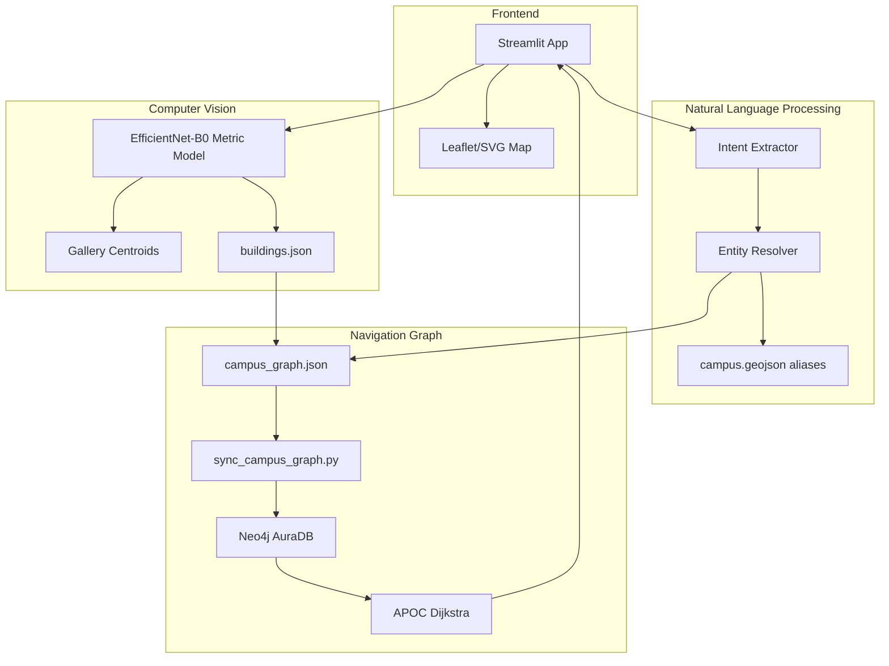

# System Architecture

The project is organized as an end-to-end AI navigation system rather than a single machine-learning model.

## Architectural Principles

- The vision model predicts semantic location classes.
- `data/buildings.json` maps CV classes to graph node IDs.
- The NLP pipeline resolves user text to graph node IDs.
- Neo4j stores the graph and performs shortest-path routing.
- Streamlit orchestrates the user workflow and renders the route.
- The graph topology controls route realism.

## Component Diagram

## Runtime Data Contracts

| File | Role |
| --- | --- |
| `data/buildings.json` | Maps CV labels to navigation `node_id` values |
| `data/campus_graph.json` | Navigation graph source of truth |
| `data/campus.geojson` | Destination labels and aliases |
| `checkpoints/best_model.pth` | Active CV model checkpoint |
| `checkpoints/gallery.pkl` | Active gallery centroid file |

## Why This Architecture?

The model is not allowed to decide routes. It only estimates the current semantic location. Navigation is handled by graph topology, which is more reliable, auditable, and easier to correct manually.

