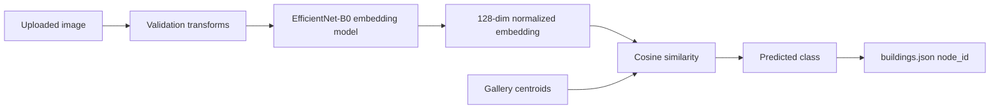

# Computer Vision

The computer vision module recognizes the user's current campus location from an uploaded image.

## Model Type

The project uses a metric-learning model based on EfficientNet-B0.

| Component | Design |
| --- | --- |
| Backbone | EfficientNet-B0 pretrained on ImageNet |
| Output | 128-dimensional L2-normalized embedding |
| Matching | Cosine similarity against gallery centroids |
| Main loss | Batch-hard triplet loss |
| Alternatives | ArcFace and combined loss |

## Inference Flow

## Metric Learning Rationale

Metric learning is useful when the campus dataset evolves over time. New locations can be added by updating the class metadata and gallery images, then retraining or rebuilding centroids.

The gallery is intentionally separated from training data to avoid inflated validation results.

## Recall@K Evaluation

Recall@K measures whether an image from the correct class appears in the top-K nearest embeddings.

| Metric | Meaning |
| --- | --- |
| Recall@1 | Correct class is the nearest retrieved class |
| Recall@3 | Correct class appears among the top 3 |
| Recall@5 | Correct class appears among the top 5 |

## Recorded Validation Stats

The recorded triplet-loss run in `outputs/training_stats.json` contains 10 epochs.

| Epoch | Train Loss | Recall@1 | Recall@3 | Recall@5 |
| --- | ---: | ---: | ---: | ---: |
| 1 | 0.4951 | 98.24% | 100.00% | 100.00% |
| 2 | 0.4039 | 98.24% | 100.00% | 100.00% |
| 3 | 0.3609 | 98.82% | 99.41% | 99.41% |
| 4 | 0.3415 | 98.82% | 100.00% | 100.00% |
| 5 | 0.3321 | 98.82% | 100.00% | 100.00% |
| 6 | 0.3260 | 98.82% | 100.00% | 100.00% |
| 7 | 0.3222 | 100.00% | 100.00% | 100.00% |
| 8 | 0.3191 | 99.41% | 100.00% | 100.00% |
| 9 | 0.3170 | 99.41% | 100.00% | 100.00% |
| 10 | 0.3151 | 99.41% | 100.00% | 100.00% |

For final academic reporting, regenerate `outputs/eval_report.json` against the current 17-class dataset.

