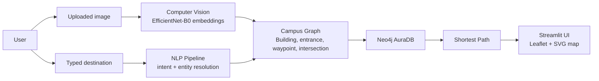

# ENSAM Smart Navigation System

ENSAM Smart Navigation System is an AI engineering project that helps users navigate the ENSAM campus by combining computer vision, natural language processing, graph-based routing, Neo4j, and a Streamlit web interface.

The user uploads an image of their current environment, the vision model predicts the likely campus location, the user types a destination, and the routing engine computes a path across a graph of real walkable campus routes.

## Core Capabilities

- Location recognition from campus building and door images.
- Metric-learning computer vision pipeline with embedding retrieval.
- Text-based destination extraction and entity resolution.
- Neo4j-backed graph navigation.
- Interactive SVG campus map rendered inside Streamlit.
- Route visualization over a realistic walkway graph.
- Dataset management, augmentation, retraining, and evaluation workflow.

## High-Level Flow

## Intended Audience

This documentation is written for:

- professors evaluating the academic engineering work,
- recruiters reviewing the project as a portfolio artifact,
- future contributors who need to extend the system,
- students who want to understand the architecture and reproduce the pipeline.

## Repository Highlights

| Area | Description |
| --- | --- |
| Computer Vision | EfficientNet-B0 metric-learning model with Recall@K evaluation |
| NLP | Destination extraction and RapidFuzz-based entity resolution |
| Navigation | Neo4j graph routing over realistic campus paths |
| Frontend | Streamlit application with interactive SVG campus map |
| Graph Tooling | Manual SVG graph editor and graph validation tests |
| Training | Reproducible augmentation, retraining, and evaluation scripts |

