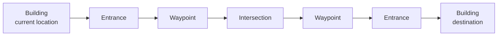

# Navigation

The navigation system computes routes over a campus graph rather than drawing direct lines between buildings.

## Graph Model

The key route model is:

```text
Building -> Entrance -> Waypoint -> Intersection -> Entrance -> Building
```



## Why This Matters

If the graph connects buildings directly, route polylines become straight lines that may cut through buildings or non-walkable areas.

Realistic routing requires small edges that follow visible paths:

- building to entrance,
- entrance to nearby waypoint,
- waypoint to intersection,
- intersection to waypoint,
- waypoint to destination entrance,
- entrance to destination building.

## Node Roles

| Role | Purpose |
| --- | --- |
| `building` | A visible destination users can select |
| `entrance` | Access point connecting a building to a path |
| `waypoint` | Intermediate point along a visible path |
| `intersection` | Path crossing or decision point |

## Route Rendering

The map renderer receives ordered path nodes from the navigation engine and draws a Leaflet polyline over the SVG campus map.

The rendered route quality depends on graph topology. The frontend does not infer roads automatically.

