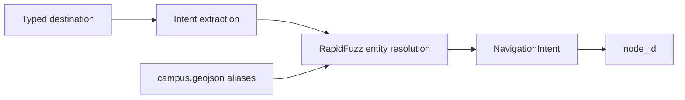

# NLP

The NLP module converts a typed destination request into a graph node ID.

## Pipeline

## Design

The pipeline separates extraction from resolution:

| Stage | Role |
| --- | --- |
| Intent extraction | Extract the raw destination phrase |
| Entity resolution | Match the phrase to a canonical campus node |

The LLM, when enabled through Ollama, is not trusted to invent node IDs. Node IDs must come from the controlled campus alias table.

## Alias Strategy

Aliases are stored in GeoJSON and may include:

- French labels,
- English translations,
- Arabic names,
- transliterations,
- abbreviations,
- common misspellings,
- informal campus names.

Improving aliases is usually more effective than changing the language model.

## Output Contract

The NLP pipeline returns a `NavigationIntent` containing:

| Field | Meaning |
| --- | --- |
| `raw_utterance` | Original typed input |
| `intent` | Navigation intent |
| `node_id` | Resolved graph node ID |
| `label` | Human-readable destination label |
| `confidence` | Normalized fuzzy matching score |
| `resolved` | Whether the destination was matched |

