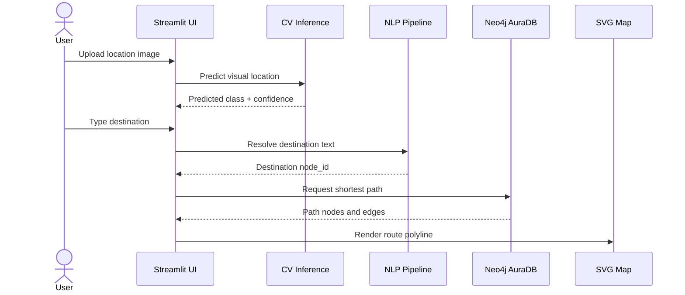

# Quickstart

This guide starts the application and runs the main workflow.

## 1. Configure Environment

Create `.env`:

```env
NEO4J_URI=neo4j+s://your-aura-instance.databases.neo4j.io
NEO4J_USER=neo4j
NEO4J_PASSWORD=your-aura-generated-password
```

## 2. Synchronize Neo4j

```bash
python scripts\sync_campus_graph.py
```

## 3. Run Streamlit

```bash
python -m streamlit run app\main.py
```

Open:

```text
http://localhost:8501
```

## 4. Use the Application

1. Upload an image of your current campus environment.
2. Confirm the detected location.
3. Type your destination.
4. Let the NLP pipeline resolve the destination.
5. View the computed route on the campus map.

## Expected Runtime Flow



