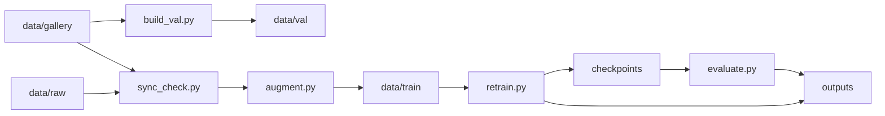

# Retraining Workflow

The retraining pipeline updates the computer vision model when new campus images or classes are added.

## Data Layout

```text
data/
|-- buildings.json
|-- raw/
|-- gallery/
|-- train/
`-- val/
```

| Directory | Role |
| --- | --- |
| `data/raw/` | Raw training images |
| `data/gallery/` | Curated reference images for gallery centroids |
| `data/train/` | Augmented training images |
| `data/val/` | Fixed validation images |

## Workflow



## Commands

Build validation data:

```bash
python -m src.build_val --data_dir data --n_images 10 --seed 42
```

Check synchronization:

```bash
python -m src.sync_check --data_dir data --checkpoint checkpoints/best_model.pth
```

Augment:

```bash
python -m src.augment --data_dir data --target_count 200 --seed 42
```

Retrain:

```bash
python -m src.retrain --data_dir data --loss triplet --seed 42
```

Evaluate:

```bash
python -m src.evaluate --data_dir data --checkpoint checkpoints/best_model.pth --gallery_path checkpoints/gallery.pkl --output_dir outputs
```

## Important Contracts

- Folder names must match labels in `data/buildings.json`.
- Each `node_id` in `data/buildings.json` must exist in `data/campus_graph.json`.
- `data/gallery/` must remain manually curated.
- Training images must not be reused as gallery centroids.
