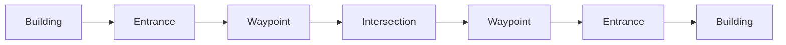

# Routing Migration Plan

This page summarizes the routing migration direction for the project.

## Objective

The navigation graph should reproduce realistic campus movement by connecting buildings through entrance, waypoint, and intersection nodes instead of drawing direct building-to-building edges.

## Target Routing Model



## Migration Rules

- Keep `data/campus_graph.json` as the current runtime source until the graph is moved to `graph/data/`.
- Preserve compatibility with `scripts/sync_campus_graph.py`.
- Keep every `node_id` from `data/buildings.json` present in the graph.
- Prefer short path-following edges over long direct edges.
- Add `entrance` nodes for each building before connecting to campus paths.
- Add `waypoint` nodes along visible roads and pedestrian paths.
- Add `intersection` nodes where route decisions happen.

## Validation

Before using a new graph:

```bash
python -m src.graph_validator --graph data\campus_graph.json
python scripts\sync_campus_graph.py
python -m pytest tests
```

If `pytest` is not installed, run the lightweight graph contract check:

```bash
python -c "import tests.test_graph_contract as t; t.test_all_building_node_ids_exist_in_campus_graph(); t.test_campus_graph_edges_reference_existing_nodes(); t.test_campus_graph_edges_have_positive_distance(); print('ok')"
```

## Current Recommendation

The safest migration path is incremental:

1. Keep the current Streamlit app working.
2. Improve graph topology with the SVG graph editor.
3. Validate graph contracts.
4. Sync Neo4j AuraDB.
5. Test routes visually on the Streamlit map.
